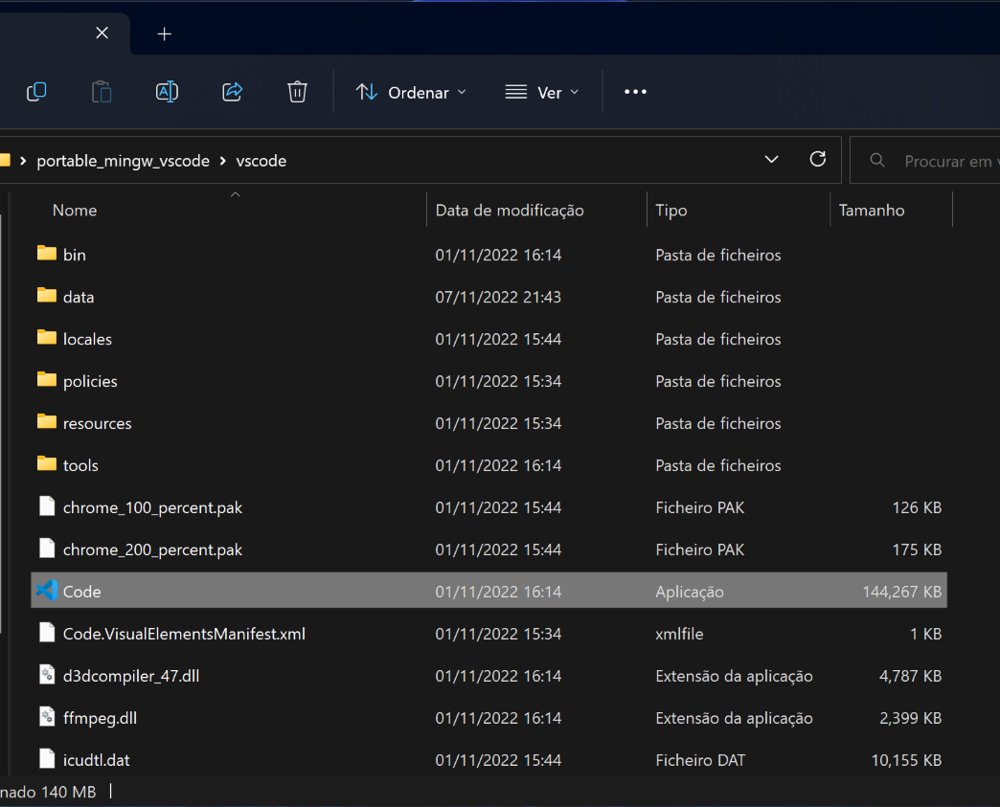

## Getting Started
{:.no_toc}

Visual Studio Code (VSCode for short) is an advanced text editor that is cross-platform. 
It works on Windows, Mac, or Linux OS.
We will use VSCode to learn C++, so buckle up and let's get started! Follow the instructions below to install VSCode on your computer **before the start of the course**, be it Windows, Mac or Linux. Check out the videos for help!

*Done installing?* Congratulations, you're all set! Head to our further instructions for [Using Visual Studio Code](https://rugtres.github.io/programming4biologists/using-vs-code) to learn more on how to use VSCode and CMake for C++.

* Table of Contents
{:toc}

### Windows OS
#### Install Visual Studio Code
* Access the shared [folder](https://drive.google.com/drive/folders/1D3FQNhDLFY7mzvIzMqOtc9LIBlh_yaRr?usp=share_link) and download `portable_mingw_vscode.7z`. If you do not have 7-zip installed in your computer, either install it from the [website](https://www.7-zip.org/download.html) or download the portable version `7z2201-x64.zip` from the same shared folder. 
* Extract the `portable_mingw_vscode.7z` archive with 7-zip to your desktop. If you are using the portable version of 7-zip, first extract the 7-zip  archive to a folder, open `7zFM.exe` and use it to extract `portable_mingw_vscode.7z` to your desktop.

#### Launch Visual Studio Code
* Navigate to `portable_mingw_vscode/vscode/` and open `Code.exe`. 

* Click on the button to trust the source.
* On the File tab at the top left corner press `Open folder`. 

* Open `portable_mingw_vscode/projects/hello_world/`.
* Press the Kit button on the bottom bar  and select `Clang++ cpp4bio`. 

* Click on `main.cpp` and press the **Launch** button on the bottom bar to run, or the bug button to run the debugger. If prompted, select `C++ (GDB/LLDB)` as a debugger. Both these steps should compile and print `Hello world!` to the console.
* You have now correctly installed VS Code and the necessary tools for the course.

### Mac OS

#### Install Visual Studio Code

1. [Download Visual Studio Code](https://go.microsoft.com/fwlink/?LinkID=534106) for macOS.
2. Open the browser's download list and locate the downloaded archive.
3. Extract the archive contents. Use double-click for some browsers or select the 'magnifying glass' icon with Safari.
4. Drag `Visual Studio Code.app` to the `Applications` folder, making it available in the macOS Launchpad.
5. Add VS Code to your Dock by right-clicking on the icon to bring up the context menu and choosing **Options, Keep in Dock**.

#### Launch Visual Studio Code and add Extensions
Open VSCode (Code) and navigate to the left-hand side menu. Click on the **Extensions** symbol . There, look for and install the following extensions:
- `ms-vscode.cmake-tools` (CMake Tools)
- `ms-vscode.cpptools` (C/C++)

<iframe style="width:100%; height:300px;" src="https://www.youtube.com/embed/BdNvJKxaBb4" title="YouTube video player" frameborder="0" allow="accelerometer; autoplay; clipboard-write; encrypted-media; gyroscope; picture-in-picture" allowfullscreen></iframe>

Download [this  zip](https://github.com/rugtres/cmake-project/archive/refs/heads/main.zip), unzip it and open the project in Visual Studio Code. Click on the **Launch** button  in the bottom menu. The programme `main.cpp` should compile and print "Hello CMake" to the screen.

### Linux OS

#### Install Visual Studio Code

* Download the shared [folder](https://drive.google.com/file/d/14Q2Lqg0fC9NeV0WBNo_ENOjts9gnx1y4/view?usp=share_link) `bootstrap-linux-x86_64.zip`.
* Extract the folder with your archive manager or in command line with `unzip path/to/folder`.
* Open your terminal and navigate to where the folder is with `cd path/to/unzipped/folder`.
* Run either of the 3 `bootstrap_*.sh` files depending if you're running Linux on Windows via [WSL](https://learn.microsoft.com/en-us/windows/wsl/), or if you use `apt` or `dnf` as your package managers. Make sure the file you run is executable with `ls -l`. The marker `x` before the file name should indicate execute mode. If not, make the file executable with `chmod +x bootstrap_*.sh` (replace `*` according to your use case).  You will be prompted for your password in the process.

*These instructions are for Linux Distributions with `apt`, such as Ubuntu or Debian, or `dnf`, such as Fedora. You will need admin rights to install VSCode.*

#### Launch Visual Studio Code

* In the terminal, `cd` into `~/projects`.
* Type `code` to run Visual Studio Code.
* Click on the button to trust the source.
* On the File tab at the top left corner press `Open folder`. 

* Open `bootstrap-linux-x86_64/projects/hello_world/`.
* Press the Kit button on the bottom bar  and select `Clang++ cpp4bio`. 

* Click on `main.cpp` and press the **Launch** button on the bottom bar to run, or the bug button to run the debugger. If prompted, select `C++ (GDB/LLDB)` as a debugger. Both these steps should compile and print `Hello world!` to the console.
* You have now correctly installed VS Code and the necessary tools for the course.

*It might be that upon opening Visual Studio Code, some of the installed extensions are disabled. This is because you are using VS code in restricted mode. 
Just click on **Trust**, and you're good to go!*

## Working on each chapter

A suggested way to organise your files involves splitting each chapter in a separate folder.
* Make a copy the `hello_world` folder in the `projects/` folder.
* Rename it to something of your choice, for example `chapter1`.
* Open VS Code as described in the installation section above and repeat the `Open folder` step. This time, select your new folder.
* It is possible that the contents you copied over contain some lingering folder specific files. To set things up properly, right click on the CMakeLists from within VS Code and choose Clean Reconfigure All Projects.

* You should now be able to build and run the code in your new folder.

