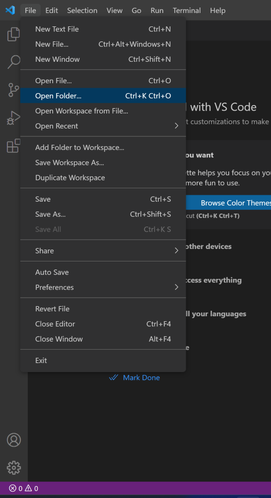

## Getting Started
{:.no_toc}

Visual Studio Code (VSCode for short) is an advanced text editor that is cross-platform. 
It works on Windows, Mac, or Linux OS.
We will use VSCode to learn C++, so buckle up and let's get started! Follow the instructions below to install VSCode on your computer **before the start of the course**, be it Windows, Mac or Linux. Check out the videos for help!

*Done installing?* Congratulations, you're all set! Head to our further instructions for [Using Visual Studio Code](https://rugtres.github.io/programming4biologists/using-vs-code) to learn more on how to use VSCode and CMake for C++.

* Table of Contents
{:toc}

### Windows OS

#### Install Visual Studio Code

* Access the shared [folder](https://drive.google.com/drive/folders/1D3FQNhDLFY7mzvIzMqOtc9LIBlh_yaRr?usp=share_link) and download `cpp4pio_2023.zip`.
* Open the downloaded `cpp4bio_2023.zip`archive and move the containing folder `cpp4bio` to your Desktop.

#### Launch Visual Studio Code
* Navigate to `cpp4bio/vscode/` and open (double-click) `Code.exe`. 


* On the File tab at the top left corner press `Open folder`. 



* Select `cpp4bio/projects/hello_world/`.
* Press the Kit button on the bottom bar  and select `Clang++ cpp4bio`. 


* Click on `main.cpp` and press the **Launch** button on the bottom bar to run, or the bug button to run the debugger. Both these steps should compile and print `Hello world!` to the console.
* You have now correctly installed VS Code and the necessary tools for the course.

### Mac OS

#### Install Homebrew

Open a terminal and run
```
/bin/bash -c "$(curl -fsSL https://raw.githubusercontent.com/Homebrew/install/HEAD/install.sh)"
```

#### Install Visual Studio Code

While still in the terminal run
```
brew install wget cmake
brew install --cask visual-studio-code
code --install-extension ms-vscode.cpptools --force
code --install-extension ms-vscode.cpptools-themes --force
code --install-extension ms-vscode.cpptools-extension-pack --force
```

* Download the `bootstrap_mac.zip` [folder](https://drive.google.com/file/d/1hiZCdaS09biA3mDYn8hRJtMyFeA-ZxK-/view?usp=share_link).
* Now copy the `projects` folder to your home-directory.</br>
* Start Visual Studio Code and select `Open folder...` from the `File` menu.</br>
* Navigate to `projects/hello_world`.

### Linux OS

#### Install Visual Studio Code

* Download the shared [folder](https://drive.google.com/file/d/14Q2Lqg0fC9NeV0WBNo_ENOjts9gnx1y4/view?usp=share_link) `bootstrap-linux-x86_64.zip`.
* Extract the folder with your archive manager or in command line with `unzip path/to/folder`.
* Open your terminal and navigate to where the folder is with `cd path/to/unzipped/folder`.
* Run either of the 3 `bootstrap_*.sh` files depending if you're running Linux on Windows via [WSL](https://learn.microsoft.com/en-us/windows/wsl/), or if you use `apt` or `dnf` as your package managers. Make sure the file you run is executable with `ls -l`. The marker `x` before the file name should indicate execute mode. If not, make the file executable with `chmod +x bootstrap_*.sh` (replace `*` according to your use case).  You will be prompted for your password in the process.

*These instructions are for Linux Distributions with `apt`, such as Ubuntu or Debian, or `dnf`, such as Fedora. You will need admin rights to install VSCode.*

#### Launch Visual Studio Code

* In the terminal, `cd` into `~/projects`.
* Type `code` to run Visual Studio Code.
* Click on the button to trust the source.
* On the File tab at the top left corner press `Open folder`. 


* Open `bootstrap-linux-x86_64/projects/hello_world/`.
* Press the Kit button on the bottom bar  and select `Clang++ cpp4bio`. 


* Click on `main.cpp` and press the **Launch** button on the bottom bar to run, or the bug button to run the debugger. If prompted, select `C++ (GDB/LLDB)` as a debugger. Both these steps should compile and print `Hello world!` to the console.
* You have now correctly installed VS Code and the necessary tools for the course.

*It might be that upon opening Visual Studio Code, some of the installed extensions are disabled. This is because you are using VS code in restricted mode. 
Just click on **Trust**, and you're good to go!*

[](https://rugtres.github.io/programming4biologists/)
